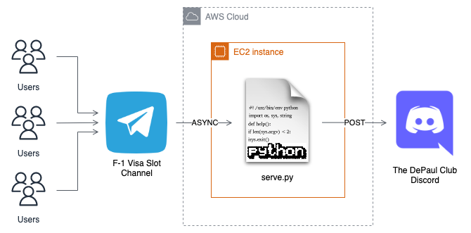

The DePaul Club Visa Bot
========================

The bot is part of the "`The DePaul Club <https://discord.gg/uJZghNMx>`_"
discord community which is a one-stop location for all your queries about
`DePaul University <https://www.depaul.edu>`_ as an International Student.

The bot aims to provide real-time updates of the current F-1 visa slot
availability in India. The data is pulled from the Telegram's famous `F1 Visa
Slot 🇺🇸 <https://t.me/F1_Visa_Slots_Only>`_ channel which is then proxied to
Discord.

Architecture
------------

Workflow
-------

The bot fetches all the real-time updates asynchronously from the Telegram
users all over India, filters through the messages and forwards them to
the "*The DePaul Club*" discord server.

As many users contribute to the visa slot updates, there's a lot of noise and
inconsistency in the incomming messages. The bot filters only the messages which
start from `no vi` OR `vi avail` characters so that it can denoise the messages
and only provide updates which are seemed more relevant.  

Once it identifies a message which is good enough to be dispatched, the bot then
performs a `POST` request and posts message in the
`#slots-update <https://discord.com/channels/1037986077769740299/1038002223646515290>`_
channel.

How-To
------

#. Make sure you SSH into your EC2 instance or server where the bot will be
   hosted. In this case, it's an AWS EC2 instance.
#. Clone the repository using git or download the zipped package.
#. Export environment variables

    #. **API_ID**: Telegram API ID
    #. **API_HASH**: Telegram API Hash
    #. **INPUT_CHANNEL_ID**: Telegram's F-1 Visa Slot channel ID.
